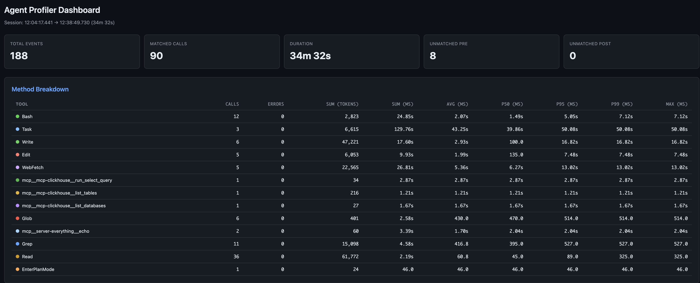
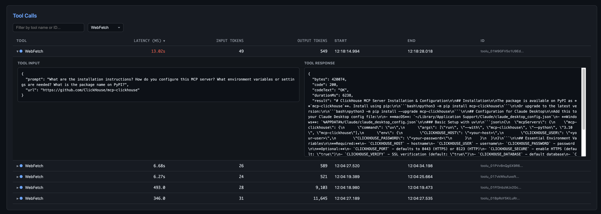
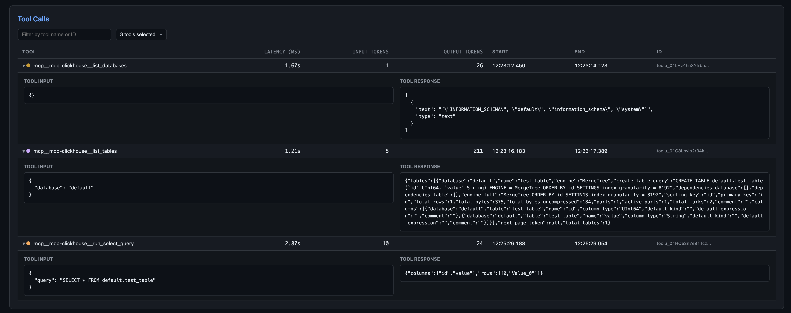

# AgentProf — A profiler for agentic coding tools

<p align="center">
    <picture>
        
    </picture>
</p>

AgentProf is a profiling tool for coding agents like Claude Code and Codex. Captures timing and token usage data, then presents results via live web dashboard or terminal reports.

## Motivation

Agentic coding tools make dozens of tool calls per session — reading files, running commands, calling MCP servers — but all of that happens behind the scenes. AgentProf makes it visible:

- **Understand what the agent is actually doing** — see every tool call with full inputs, outputs, and timing
- **Control costs** — identify which tools consume the most tokens, since that directly maps to API spend
- **Find bottlenecks** — spot slow tools, excessive retries, or stuck sessions that waste time and money
- **Optimize workflows** — tune your prompts, hooks, or MCP servers and measure the difference across sessions
- **Audit tool usage** — review exactly what the agent called and with what arguments, for security or compliance

## Install

```bash
curl -LsSf https://github.com/kitaisreal/agentprof/releases/latest/download/agentprof-installer.sh | sh
```

Or build from source:

```bash
cargo install --path .
```

## Web UI Examples

Dashboard:



Tools calls, for example `WebFetch`:


MCP calls, for example `ClickHouse`:



### Profiling Claude Code

Install profiling hooks into Claude Code settings file:

```bas
# Local project (writes .claude/settings.local.json)
agentprof install --log ./claude-tools.jsonl

# Global (writes ~/.claude/settings.json)
agentprof install --log /tmp/claude-tools.jsonl --global
```

This registers `PreToolUse` and `PostToolUse` hooks that log every tool call with timestamps and token counts. Start using Claude Code normally and the log file will be populated automatically.

To remove the hooks:

```bash
agentprof uninstall          # local
agentprof uninstall --global # global
```

### Viewing results

**Web dashboard:**

```bash
agentprof web ./claude-tools.jsonl
# or specify a port
agentprof web ./claude-tools.jsonl -p 3000
```

Opens a live-updating dashboard at `http://localhost:8080` with:

- Summary cards (total events, matched calls, duration)
- Method breakdown table (calls, errors, token usage, latency percentiles)
- Tool calls table with expandable input/response details and token counts
- Visual timeline of all tool calls
- Top 10 slowest calls

The dashboard auto-refreshes when the log file changes via Server-Sent Events.

**Terminal report:**

```bash
agentprof analyze ./claude-tools.jsonl
```

Prints session summary, per-method breakdown with percentile latencies, and slowest calls.


## Commands

| Command | Description |
|---------|-------------|
| `agentprof install --log <path> [--global\|--local]` | Add profiling hooks to Claude Code settings |
| `agentprof uninstall [--global\|--local]` | Remove profiling hooks |
| `agentprof hook --log <path>` | Log a single hook event from stdin (used internally) |
| `agentprof analyze <log_file>` | Print a terminal profiling report |
| `agentprof web <log_file> [-p port]` | Launch the web dashboard |

## How it works

```
Claude Code  -->  PreToolUse/PostToolUse hooks  -->  agentprof hook  -->  JSONL log

JSONL log  -->  agentprof analyze  -->  terminal report
JSONL log  -->  agentprof web      -->  browser dashboard (live-updating)
```

Each log entry records timestamps, tool names, tool use IDs, input/output payloads, estimated token counts, and latency. The analyzer correlates `PreToolUse`/`PostToolUse` pairs to compute per-tool statistics.
